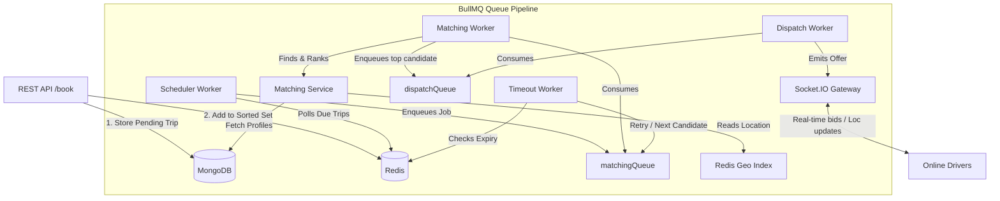

# Acting Driver Matching Engine

The **Acting Driver Matching Engine** is the core real-time matchmaking, routing, and dispatching service for PublicRides' acting drivers. It coordinates passenger trip requests with nearby, qualified online drivers using a highly optimized, queue-based distributed pipeline and real-time WebSockets.

---

## Architecture Overview

The engine utilizes a multi-layered design ensuring state consistency, real-time feedback, and high throughput:



### Key Technical Pillars

1. **State Synchronization**: Dual-layer architecture combining Redis (for high-speed matching state, lockouts, geolocation search, and queue data) and MongoDB (for persistent transactional storage of trips and historical driver profiles).
2. **Distributed Queue System**: Built on **BullMQ** with separate worker pools to isolate tasks:
   - `ad_scheduler`: Periodically triggers (every 5 seconds) to identify immediate or scheduled bookings ready for matchmaking.
   - `ad_matching`: Filters, scores, and ranks drivers, generating shortlists.
   - `ad_dispatch`: Delivers ride requests to drivers in a waterfall sequence.
   - `ad_cleanup`: Sanitizes matching states and active locks in Redis once a trip resolves.
3. **Advanced Scoring Engine**: Shortlisted drivers within a 10km radius are scored out of 100 based on configurable weights:
   - **Distance/ETA** (e.g., higher score for closer drivers)
   - **Driver Rating** (derived from historical ratings)
   - **Vehicle Handling Compatibility** (verifies experience driving requested vehicle class)
   - **Platform Experience & Tenure** (bonus for drivers with 3+ or 5+ years)
   - **Night Ride Compatibility** (matches drivers flagged for night shifts with night trips)
   - **Long Distance Compatibility** (checked for trips > 50km)
   - **Historical Acceptance/Rejection Rate**
4. **Calendar Conflict Guard**: For scheduled trips, the engine verifies driver schedules, calculating trip durations, travel times between drop-off and new pickup, and adding customizable buffer rest times to guarantee no overlapping bookings.
5. **Real-time Gateway**: A WebSocket server utilizing **Socket.IO** to publish bid requests to drivers and stream back location updates (saved directly to Redis geospatial sets).

---

## Directory Structure

```text
acting-driver-engine/
├── src/
│   ├── api/
│   │   ├── controllers/      # HTTP handlers (tripController, driverController)
│   │   └── routes/           # REST endpoints mapping
│   ├── config/
│   │   ├── db.js             # Mongoose/MongoDB connection & setup
│   │   ├── env.js            # Strict environment variable validation
│   │   └── redis.js          # Shared/dedicated Redis clients
│   ├── models/
│   │   ├── Driver.js         # Mongoose Schema for Driver Profiles & stats
│   │   ├── Trip.js           # Mongoose Schema for Trip transactions & match logs
│   │   └── Vehicle.js        # Mongoose Schema for Vehicles
│   ├── queues/
│   │   ├── index.js          # BullMQ Queue entry point
│   │   └── *Queue.js         # Queue definitions (matching, dispatch, scheduler, cleanup)
│   ├── services/
│   │   ├── cancellationService.js # Booking abort & refund procedures
│   │   ├── driverLocationService.js # Geolocation updates & radial search
│   │   ├── matchingService.js     # Filter, score, and rank algorithms
│   │   ├── redisStateService.js   # Redis write/read helpers
│   │   └── tripService.js         # MongoDB persistence operations
│   ├── socket/
│   │   ├── gateway.js        # Socket.IO Server setup
│   │   └── handlers.js       # Real-time WebSocket packet parsing
│   ├── utils/
│   │   ├── constants.js      # Global config objects, timing bounds, event names
│   │   ├── logger.js         # Winston logger configuration
│   │   └── rideIdGenerator.js# Unique ride ID constructor (e.g., ADCMR250812XXXXXX)
│   ├── workers/
│   │   └── *Worker.js        # Background job processors (matching, timeout, scheduler...)
│   └── app.js                # App entrypoint (initializes DBs, starts workers, mounts API)
├── tests/
│   └── *.test.js             # Jest unit & integration tests
├── .env.example              # Environment variables template
├── .gitignore                # Node.js and configuration ignores
├── package.json              # Script definitions and dependencies
└── README.md                 # Project Documentation
```

---

## API Documentation

### Book a Trip
Creates a trip, saves it to the database, and schedules it for matching.

- **URL**: `/api/v2/trips/book` (Alternative: `/api/trips/book` for legacy support)
- **Method**: `POST`
- **Content-Type**: `application/json`

#### Request Payload
```json
{
  "userId": "usr_91238472",
  "startLocation": [77.2090, 28.6139], // [longitude, latitude]
  "endLocation": [77.2167, 28.6252],   // [longitude, latitude]
  "vehicleType": "sedan",               // vehicle category (e.g., hatchback, sedan, suv)
  "isScheduledTrip": false,
  "scheduleDateTime": 1780486955000,   // Required if isScheduledTrip: true (Timestamp in ms)
  "passangerId": "60d000000000000000000001", // Optional
  "regionCode": "CMR",                  // Optional (Default: "CMR")
  "createdBy": "passenger_app"          // Optional
}
```

#### Response (Status: `211 Created`)
```json
{
  "success": true,
  "trip": {
    "rideId": "ADCMR120626A98B2",
    "isActingDriverTrip": true,
    "isScheduledTrip": false,
    "status": "PENDING",
    "vehicleType": "sedan",
    "userId": "usr_91238472",
    "passangerId": "60d000000000000000000001",
    "createdBy": "passenger_app",
    "startLocation": [77.209, 28.6139],
    "endLocation": [77.2167, 28.6252],
    "bookingTime": 1780486900000,
    "regionCode": "CMR",
    "_id": "60d000000000000000000002",
    "__v": 0
  }
}
```

---

## WebSocket Protocol (Socket.IO)

Clients connect to the Socket.IO gateway. Below are the core real-time events.

### Outbound Events (Server -> Client)

- **`trip_offer`**: Sent to the targeted driver on dispatch. Contains details of the trip.
  ```json
  {
    "tripId": "60d000000000000000000002",
    "rideId": "ADCMR120626A98B2",
    "startLocation": [77.209, 28.6139],
    "endLocation": [77.2167, 28.6252],
    "vehicleType": "sedan",
    "timeoutMs": 15000
  }
  ```

- **`trip_cancelled`**: Notifies the driver that the offered trip was cancelled or reassigned.
  ```json
  {
    "tripId": "60d000000000000000000002"
  }
  ```

### Inbound Events (Client -> Server)

- **`driver_location_update`**: Real-time GPS coordinate transmission from online drivers.
  ```json
  {
    "driverId": "60d000000000000000000100",
    "longitude": 77.2091,
    "latitude": 28.6140,
    "regionCode": "CMR"
  }
  ```

- **`trip_accept`**: Sent by the driver to accept the dispatched offer.
  ```json
  {
    "driverId": "60d000000000000000000100",
    "tripId": "60d000000000000000000002"
  }
  ```

- **`trip_reject`**: Sent by the driver to decline the dispatched offer.
  ```json
  {
    "driverId": "60d000000000000000000100",
    "tripId": "60d000000000000000000002"
  }
  ```

---

## Configuration & Scoring Weights

Configure parameters via the environment variable space `.env`. Essential customizable weights in scoring include:

| Parameter | Default Weight | Description |
| :--- | :--- | :--- |
| `SCORE_WEIGHT_DISTANCE` | `40` | Preference for drivers closer to pickup |
| `SCORE_WEIGHT_RATING` | `20` | Preference for higher rated drivers |
| `SCORE_WEIGHT_VEHICLE_MATCH` | `15` | Experience handling requested vehicle class |
| `SCORE_WEIGHT_EXPERIENCE` | `10` | Tenure on platform (e.g. 3+ years) |
| `SCORE_WEIGHT_NIGHT_DRIVING` | `5` | Experience and approval for late night shifts |
| `SCORE_WEIGHT_LONG_DISTANCE` | `5` | Preference for drivers willing to make long trips (>50km) |
| `SCORE_WEIGHT_ACCEPTANCE_RATE` | `5` | Incentive for maintaining high acceptance behavior |

---

## Setup & Running Instructions

### Prerequisites
Make sure you have the following installed:
- **Node.js** (v18.x or above)
- **MongoDB** (Running on port `27017` or configured differently in `.env`)
- **Redis Server** (Running on port `6379`)

### Installation & Run

1. Clone the repository and install dependencies:
   ```bash
   npm install
   ```

2. Copy the template and customize environment variables:
   ```bash
   cp .env.example .env
   ```

3. Launch in development mode (starts Nodemon, auto-loading database connections, Socket gateway, and background worker queues):
   ```bash
   npm run dev
   ```

4. Launch in production mode:
   ```bash
   npm start
   ```

### Running Tests
Execute unit and integration tests using Jest:
```bash
npm test
```
