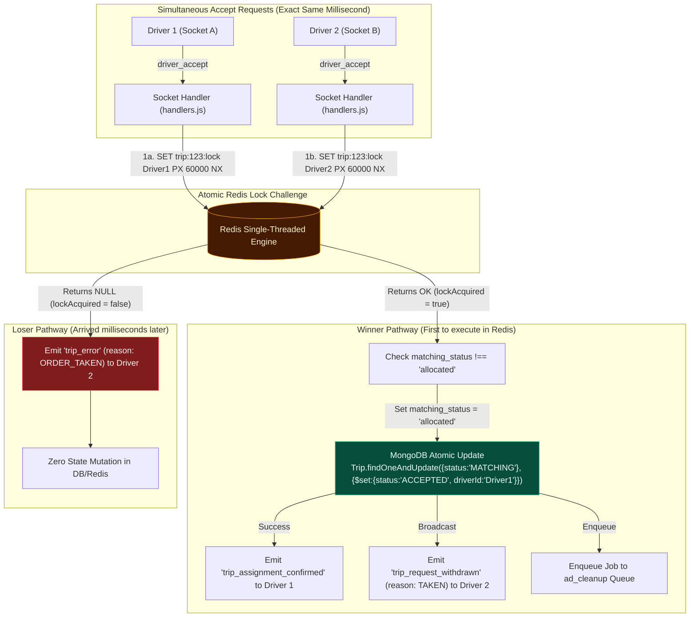

# System Architecture & Race Condition Diagrams

## 1. End-to-End System Architecture Diagram

```mermaid
flowchart LR
    %% Subgraph 1: Ingestion & API Layer
    subgraph INGESTION["1. Trip Ingestion Layer"]
        P[Passenger App] -->|POST /api/v2/trips/book| API[Express REST API<br/>tripController.js]
    end

    %% Subgraph 2: System Datastores
    subgraph DATASTORES["2. System Data & State Stores"]
        MDB[(MongoDB<br/>System of Record)]
        RDS[(Redis State Store<br/>GEO ZSET / Hashes / Sets / Locks)]
    end

    %% Subgraph 3: Scheduling & Queue Infrastructure
    subgraph SCHEDULING["3. Scheduler & Queue Infrastructure"]
        SCH_W[Scheduler Worker<br/>schedulerWorker.js]
        BMQ_SCH[[BullMQ Queue<br/>ad_scheduler]]
        BMQ_MAT[[BullMQ Queue<br/>ad_matching]]
        BMQ_DSP[[BullMQ Queue<br/>ad_dispatch]]
        BMQ_CLN[[BullMQ Queue<br/>ad_cleanup]]
    end

    %% Subgraph 4: Matching & Scoring Engine
    subgraph MATCHING["4. Driver Matching & Scoring Engine"]
        MAT_W[Matching Worker<br/>matchingWorker.js]
        GEO[Redis GEORADIUS<br/>10km Radius Search]
        FILT[10 Strict Filters<br/>Online, Status, Vehicle, Calendar Buffer]
        SCORE[Multi-Factor Scoring<br/>0-100 Pts: Distance, Rating, Experience]
        SHORT[Top 5 Candidate<br/>Shortlist Generator]
    end

    %% Subgraph 5: Real-Time Dispatch & WebSockets
    subgraph DISPATCH["5. Dispatch & WebSocket Gateway"]
        DSP_W[Dispatch Worker<br/>dispatchWorker.js]
        GW[Socket.IO Gateway<br/>gateway.js / handlers.js]
    end

    %% Subgraph 6: Driver interaction & Concurrency Guard
    subgraph DRIVERS["6. Driver Interaction & Concurrency Control"]
        DRV[Driver App Rooms<br/>driver:room:driverId]
        LOCK{Redis Distributed Lock<br/>SET trip:id:lock NX PX 60000}
        ASSIGN[Assignment & State Mutation<br/>Trip Status: ACCEPTED]
    end

    %% Subgraph 7: Retry, Timeout & Rematch Flow
    subgraph RECOVERY["7. Timeout, Retry & Rematch Engine"]
        TMO_W[Timeout Verification Worker<br/>timeoutWorker.js]
        CAN_S[Cancellation Service<br/>cancellationService.js]
        CLN_W[Cleanup Worker<br/>cleanupWorker.js]
    end

    %% Connections
    API -->|1. Save Trip 'PENDING'| MDB
    API -->|2. ZADD scheduler:pending_trips| RDS
    
    BMQ_SCH -->|Polls every 5s| SCH_W
    SCH_W -->|3. ZRANGEBYSCORE due trips| RDS
    SCH_W -->|4. Update status 'MATCHING'| MDB
    SCH_W -->|5. Enqueue matching job| BMQ_MAT

    BMQ_MAT -->|6. Process match job| MAT_W
    MAT_W -->|7a. Spatial lookup| GEO
    GEO -->|Fetches nearby| RDS
    MAT_W -->|7b. Fetch candidate profiles| MDB
    MAT_W -->|7c. Filter candidates| FILT
    FILT -->|7d. Score candidates| SCORE
    SCORE -->|7e. Select Top 5| SHORT
    SHORT -->|8. Store shortlist JSON| RDS
    SHORT -->|9. Enqueue dispatch job| BMQ_DSP

    BMQ_DSP -->|10. Process dispatch| DSP_W
    DSP_W -->|11. Emit 'trip_request'| GW
    GW -->|12. Real-time alert| DRV
    DSP_W -->|13. Schedule 15s delayed check| BMQ_MAT

    DRV -->|14a. Driver Reject| GW
    GW -->|Record response & exclude| RDS
    GW -->|All candidates rejected/timed out| BMQ_MAT

    DRV -->|14b. Driver Accept| GW
    GW -->|15. Lock Challenge| LOCK
    LOCK -->|WINNER: Lock Acquired| ASSIGN
    ASSIGN -->|16a. Update DB status 'ACCEPTED'| MDB
    ASSIGN -->|16b. Emit 'trip_assignment_confirmed'| DRV
    ASSIGN -->|16c. Emit 'trip_request_withdrawn'| DRV
    ASSIGN -->|16d. Trigger cleanup| BMQ_CLN

    LOCK -->|LOSER: Lock Denied| GW
    GW -->|Emit 'trip_error: ORDER_TAKEN'| DRV

    BMQ_MAT -->|17. Delayed 15s Timeout Check| TMO_W
    TMO_W -->|If non-allocated & Attempt < 3| BMQ_MAT
    TMO_W -->|If Attempt = 3 Max Reached| MDB
    TMO_W -->|Mark 'failed' & Cleanup| BMQ_CLN

    DRV -->|18. Post-Accept Cancellation| CAN_S
    CAN_S -->|If Count < 3: Exclude & Priority 1 Rematch| BMQ_MAT
    CAN_S -->|If Count >= 3: Mark 'failed'| MDB
    CAN_S -->|Trigger Cleanup| BMQ_CLN

    BMQ_CLN -->|19. Wipe transient keys| CLN_W
    CLN_W -->|Pipeline DEL trip keys| RDS

    %% Styling
    classDef datastore fill:#1e293b,stroke:#64748b,color:#f8fafc;
    classDef worker fill:#0f172a,stroke:#3b82f6,color:#f8fafc;
    classDef lock fill:#451a03,stroke:#f59e0b,color:#fef3c7;
    class MDB,RDS datastore;
    class SCH_W,MAT_W,DSP_W,TMO_W,CLN_W worker;
    class LOCK lock;
```

---

## 2. Simultaneous Driver Acceptance Race Condition Diagram

---

## 3. Interview Walkthrough Guide (2–3 Minutes)

### 1. Ingestion & Timer-Wheel Scheduling (0:00 – 0:30)
> *"Starting on the far left, when a passenger requests a ride via `POST /api/v2/trips/book`, the API instantly saves a trip document in MongoDB with a `PENDING` status. To maintain high throughput and decouple request handling, the trip ID is pushed into a Redis Sorted Set (`scheduler:pending_trips`) scored by timestamp. Both immediate and scheduled rides enter this same ZSET. Every 5 seconds, a BullMQ `Scheduler Worker` queries due trips via `ZRANGEBYSCORE`, sets the state to `MATCHING` in MongoDB, and pushes a job to the `ad_matching` queue."*

### 2. Candidate Filtering & Multi-Factor Scoring (0:30 – 1:15)
> *"Moving to the center matching engine: the `Matching Worker` processes the matching job by first calling Redis `GEORADIUS` to perform a 10km spatial search of online drivers. It then evaluates candidates through 10 strict filter checks—evaluating online presence, vehicle handling capability, and for scheduled trips, calculating calendar travel time buffers using Haversine distance. Remaining eligible drivers undergo multi-factor weighted scoring (0–100 points) balancing distance, rating, experience, and acceptance rates. The top 5 candidates are shortlisted, cached in Redis, and pushed to the `ad_dispatch` queue."*

### 3. Real-Time Dispatch & WebSocket Gateway (1:15 – 1:45)
> *"The `Dispatch Worker` broadcasts a real-time `trip_request` event over Socket.IO targeted specifically to private driver socket rooms (`driver:room:driverId`). Simultaneously, it registers a 15-second delayed timeout check job back into BullMQ as a fallback safety net."*

### 4. Concurrency Guard & Atomic Acceptance (1:45 – 2:30)
> *"When multiple shortlisted drivers tap 'Accept' at the exact same millisecond, the Socket gateway runs an atomic challenge lock against Redis using `SET trip:{id}:lock driverId PX 60000 NX`. Because Redis is single-threaded, exactly one driver acquires the lock. The winner atomically updates MongoDB status to `ACCEPTED`, receives `trip_assignment_confirmed`, and triggers a cleanup job (`ad_cleanup`). The losing driver immediately gets `trip_error (ORDER_TAKEN)` and a `trip_request_withdrawn` notification."*

### 5. Timeout, Retry & Rematch Recovery (2:30 – 3:00)
> *"Finally, on the lower recovery path: if all shortlisted drivers reject or the 15-second timer expires, the `Timeout Worker` excludes non-responsive drivers in a Redis SET and automatically enqueues attempt 2 (up to a max of 3 attempts). If an assigned driver cancels before pickup, the `Cancellation Service` checks prior cancellation counts—if under 3, it clears the driver's active trip state and re-enqueues the job with high priority (`priority: 1`) for an immediate rematch."*
